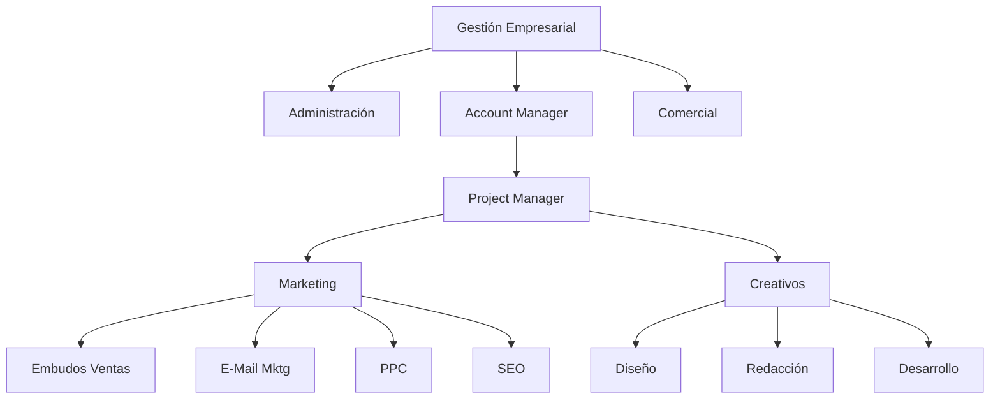

# Estructurar una Microagencia de Marketing Digital 🟡③

* [[PublicBrain/Index|Index]] 
	* [[Mis Apuntes del Curso de Platzi Estructurar una Microagencia de Marketing Digital 🔴②]]
	* [[Glosario de Marketing Digital ⚫①]]

Inspirado en este [[Curso de Platzi sobre Estructurar una Microagencia de Marketing Digital 🔴②]] estoy desarrollando mi metodología sobre habilidades, perfiles y tareas para MetsuOS tomando como base lo aprendido en este curso, para posteriormente integrar mas conocimientos.

## Organigrama de la microagencia

{[MOS::Modelos:
	:Organizaciones::Negocio:
		:MicroagenciaPublicidad::GetStructure]}

* [[Rol Gestión Empresarial en una Microagencia de Marketing Digital 🔴②-⚖️🔴②|Gestión Empresarial 🔴②-⚖️🔴②]]
	* [[Rol Comercial 🔴②|Comercial 🔴②]]
	* [[Rol Administración Negocios 🔴②|Administración 🔴②]]
	* [[Rol Account Manager 🔴②|Account Manager 🔴②]]
		* [[Rol Project Manager 🔴②|Project Manager 🔴②]]
			* [[Departamento Marketing (Microagencia Marketing Digital) 🔴②|Marketing 🔴②]]
				* [[Rol Experto en Embudos de Venta 🔴②|Expertos en Embudos de ventas 🔴②]]
				* [[Rol Experto en EMail Marketing 🔴②|Expertos en Email marketing 🔴②]]
				* [[Rol Expertos en PPC 🔴②|Expertos en PPC 🔴②]]
				* [[Rol Expertos en SEO 🔴②|Expertos en SEO 🔴②]]
			* [[Departamento Creativo (Microagencia Marketing Digital) 🔴②|Creativo 🔴②]]
				* [[Rol Diseño Gráfico 🔴②|Diseño Gráfico 🔴②]]
				* [[Rol Redacción publicitaria 🔴②|Redacción Publicitaria 🔴②]]
				* [[Rol Desarrollo web 🔴②|Desarrollo Web 🔴②]]

* Fase 0: Tomar apuntes del curso... DONE
* Fase 1: Modelar agencia (departamentos, puestos ...) ... IN PROGRESS
* Fase 2: Modelar puestos (rol, responsabilidades ...) .. IN PROGRESS
* Fase 3: Modelar roles, habilidades (duras y blandas) .. IN PROGRESS
* Fase 4: Modelar cada uno de los elementos de responsabilidad, etc, etc, etc) ... FUTURE
* Fase 5: Enlazar esto con la ejecución real de las diferentes tareas via MetsuOS ... FUTURE
* Fase 6: Georgi Dan ... FUTURE

## Referencias Bibliográficas

## ### Referencias bibliograficas que apoyan el contenido

_Estos autores respaldan la división por departamentos, la especialización de roles y la necesidad de figuras de gestión (Project/Account Managers) para el éxito comercial._

1. [Maister, David H. (1993). Managing The Professional Service Firm. 🟡③🌐](https://www.simonandschuster.com/books/Managing-The-Professional-Service-Firm/David-H-Maister/9780684834313) .- Guía accesible para la gestión de firmas profesionales, cubriendo temas desde marketing hasta liderazgo, enfatizando servicio al cliente, carreras satisfactorias y éxito financiero.
2. [Levinson, Jay Conrad. (2007). Guerrilla Marketing. 🟡③🌐](https://www.barnesandnoble.com/w/guerrilla-marketing-4th-edition-jay-conrad-levinson-president/1111826898) .- Edición actualizada del libro que presenta estrategias de marketing de guerrilla para pequeños negocios, incluyendo tácticas de bajo costo, marketing en internet y cultivo de clientes repetidos.
3. [Wheeler, Alina. (2017). Designing Brand Identity. 🟡③🌐](https://www.barnesandnoble.com/w/designing-brand-identity-alina-wheeler/1101202566) .- Guía esencial para equipos de branding con fundamentos, procesos, checklists, diagramas y más de 50 estudios de caso que ilustran la creación y mantenimiento de marcas fuertes.
        
## Referencias bibliograficas que refutan el contenido

_Estos autores refutan la estructura departamental tradicional, argumentando que genera "silos", lentitud y costos operativos innecesarios para una agencia moderna._

1. [Gothelf, Jeff & Seiden, Josh. (2016). Lean UX. 🟡③🌐](https://books.google.com/books/about/Lean_UX.html?id=QnQNDQAAQBAJ) .- Texto fundamental sobre el enfoque ágil en el diseño de productos que aboga por la eliminación de silos departamentales y la colaboración continua en equipos multidisciplinarios, con énfasis en experimentación, iteración y aprendizaje del usuario real (edición 2016 accesible vía Google Books preview).
2. [Fried, Jason & Hansson, David Heinemeier. (2010). Rework. 🟡③🌐](https://www.penguinrandomhouse.com/books/56502/rework-by-jason-fried-and-david-heinemeier-hansson/) .- Manifiesto empresarial que critica la burocracia, las reuniones innecesarias y el exceso de gestión intermedia, proponiendo estructuras mínimas y altamente productivas.
3. [Sutherland, Jeff. (2014). Scrum: The Art of Doing Twice the Work in Half the Time. 🟡③🌐](https://www.scruminc.com/new-scrum-the-book/) .- Guía definitiva sobre la metodología Scrum que propone equipos autónomos y empoderados para gestionar su propio flujo de trabajo, eliminando la jerarquía de mando tradicional.
4. [Pink, Daniel H. (2001). Free Agent Nation. 🟡③🌐](https://www.danpink.com/books/free-agent-nation/) .- Análisis sobre el auge del trabajador independiente y las microempresas, argumentando que la estructura de la gran corporación está siendo reemplazada por redes de talento flexible.

![[Plantilla - 1MT#One More Thing]]