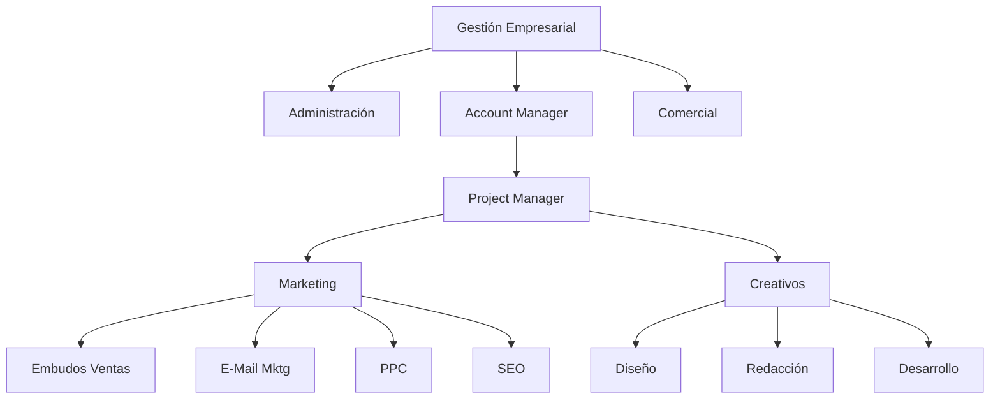

# Estructurar una Microagencia de Marketing Digital

* [[PublicBrain/Index|Imdex]] 
	* [[Mis Apuntes del Curso de Platzi Estructurar una Microagencia de Marketing Digital]]
	* [[Glosario de Marketing Digital]]

Inspirado en este [[Curso de Platzi sobre Estructurar una Microagencia de Marketing Digital]] estoy desarrollando mi metodología sobre habilidades, perfiles y tareas para MetsuOS tomando como base lo aprendido en este curso, para posteriormente integrar mas conocimientos.

## Organigrama de la microagencia

{[MOS::Modelos:
	:Organizaciones::Negocio:
		:MicroagenciaPublicidad::GetStructure]}

* [[Rol Gestión Empresarial|Gestión ste rol se Empresarial]]
	* [[PublicBrain/Rol Comercial|Comercial]]
	* [[Rol Administración Negocios|Administración]]
	* [[Rol Account Manager|Account Manager]]
		* [[Rol Project Manager|Project Manager]]
			* [[Departamento Marketing (Microagencia Marketing Digital)|Marketing]]
				* [[Rol Experto en Embudos de Venta|Expertos en Embudos de ventas]]
				* [[Rol Experto en EMail Marketing|Expertos en Email marketing]]
				* [[Rol Expertos en PPC|Rol Expertos en PPC]]
				* [[Rol Expertos en SEO|Expertos en SEO]]
			* [[Departamento Creativo (Microagencia Marketing Digital)|Creativo]]
				* [[Rol Diseño Gráfico|Diseño Gráfico]]
				* Redacción publicitaria
				* Desarrollo web

{{MOS::Templates::Platzi_Referal}}

## Log

* Fase 0: Tomar apuntes del curso... DONE
* Fase 1: Modelar agencia (departamentos, puestos ...) ... IN PROGRESS
* Fase 2: Modelar puestos (rol, responsabilidades ...) .. IN PROGRESS
* Fase 3: Modelar roles, habilidades (duras y blandas) .. IN PROGRESS
* Fase 4: Modelar cada uno de los elementos de responsabilidad, etc, etc, etc) ... FUTURE
* Fase 5: Enlazar esto con la ejecución real de las diferentes tareas via MetsuOS ... FUTURE
* Fase 6: Georgi Dan ... FUTURE

