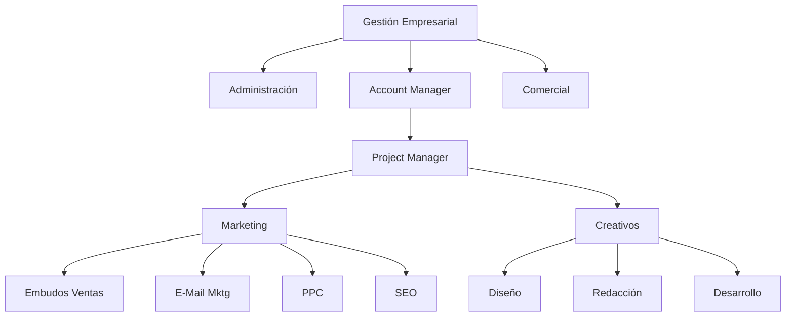

# Estructurar una Microagencia de Marketing Digital

[[PublicBrain/Index]] | [[Mis Apuntes del Curso de Platzi Estructurar una Microagencia de Marketing Digital]]

Inspirado en este [[Curso de Platzi sobre Estructurar una Microagencia de Marketing Digital ]] estoy desarrollando mi metodología sobre habilidades, perfiles y tareas para MetsuOS tomando como base lo aprendido en este curso, para posteriormente integrar mas conocimientos.

## Organigrama de la microagencia

{[MOS::Modelos::Organizaciones::Negocio::MicroagenciaPublicidad::GetStructure]}

* Gestión Empresarial
	* [[PublicBrain/Rol Comercial|Comercial]]
	* Administración
	* Account Manager
		* Project Manager
			* Marketing
				* Expertos en Embudos de ventas
				* Expertos en e-mail marketing
				* Expertos en PPC
				* Expertos en SEO
			* Creativos
				* Diseño Gráfico
				* Redacción publicitaria
				* Desarrollo web

* Fase 0: Tomar apuntes del curso... DONE
* Fase 1: Modelar agencia (departamentos, puestos ...) ... IN PROGRESS
* Fase 2: Modelar puestos (rol, responsabilidades ...) .. IN PROGRESS
* Fase 3: Modelar roles, habilidades (duras y blandas) .. IN PROGRESS
* Fase 4: Modelar cada uno de los elementos de responsabilidad, etc, etc, etc) ... FUTURE
* Fase 5: Enlazar esto con la ejecución real de las diferentes tareas via MetsuOS ... FUTURE
* Fase 6: Georgi Dan ... FUTURE

