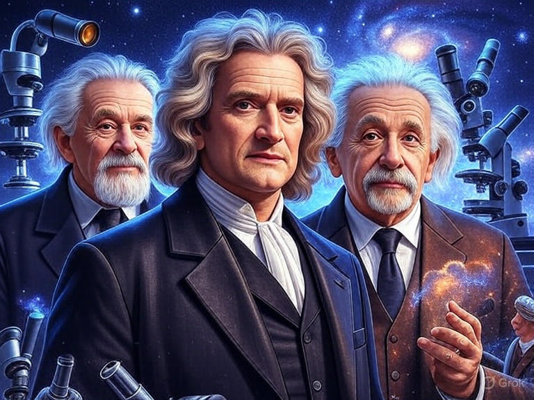

# Historia de la Ciencia y del Método Científico 🔴②

* [[PublicBrain/Index|Index]]
* Revisar
	* [[Definición de ciencia y método científico 🔴②]]
	* [[Conceptos básicos sobre ciencia y su evolución histórica 🔴②]]
	* [[Distinción entre ciencia, tecnología y otras formas de la c conocimiento  🔴②]]

## Introducción

La ciencia representa una de las aventuras más fascinantes de la humanidad, un proceso sistemático para comprender el mundo que nos rodea. El método científico, por su parte, es el conjunto de pasos lógicos y rigurosos que guían esta exploración, evolucionando a lo largo de los siglos. En esta sección, exploraremos los conceptos básicos sobre la ciencia y su desarrollo histórico, distinguiendo entre ciencia pura, tecnología aplicada y otras formas de conocimiento, como la filosofía o la tradición oral.

La historia de la ciencia es fundamental porque nos proporciona el contexto necesario para apreciar cómo ha evolucionado el saber humano. Nos ayuda a entender no solo los avances técnicos, sino también su impacto en la sociedad actual, influyendo en la educación y en la toma de decisiones políticas y éticas. Los objetivos de este contenido son explorar la evolución histórica de la ciencia y sus métodos, analizar cómo interactúa con la sociedad, la cultura y la ética, y fomentar una reflexión crítica sobre el presente y el futuro de la humanidad.

## Orígenes de la Ciencia

### Prehistoria y Antigüedad

Desde los albores de la humanidad, los seres humanos han observado el cielo con asombro. En la prehistoria, estructuras megalíticas como Stonehenge en Inglaterra servían como observatorios astronómicos primitivos, permitiendo registrar ciclos lunares y estacionales para fines agrícolas y rituales.

En las antiguas civilizaciones de Mesopotamia y Egipto, la ciencia tomó formas más estructuradas. Los babilonios desarrollaron sistemas numéricos avanzados y una astronomía precisa para predecir eclipses, mientras que en Egipto, la geometría se aplicaba en la construcción de pirámides y la medicina se basaba en observaciones empíricas.

La Antigua Grecia marcó un hito con la filosofía natural. Los presocráticos, como Tales de Mileto, Heráclito y Pitágoras, buscaron explicaciones racionales para los fenómenos naturales. Platón propuso una cosmología idealista con su teoría de las formas, y Aristóteles estableció fundamentos en lógica, física y biología mediante observación sistemática.

No podemos olvidar las contribuciones de Oriente: en la India, surgió el sistema decimal, la astronomía védica y la medicina ayurvédica; en China, invenciones como la pólvora, la brújula y el papel impulsaron avances tecnológicos, junto con observaciones astronómicas detalladas.

### Edad Media

Durante la Edad Media, el mundo islámico se convirtió en un faro de conocimiento. Los eruditos musulmanes tradujeron y expandieron obras griegas, logrando avances en álgebra con Al-Khwarizmi, óptica con Alhazen y medicina con Avicena.

En Europa, la escolástica integró el pensamiento aristotélico en las universidades, sintetizando fe y razón. Roger Bacon promovió el experimentalismo temprano, sentando bases para métodos futuros. Los monasterios preservaron textos antiguos, y las traducciones del árabe al latín facilitaron el intercambio cultural entre civilizaciones.

### Renacimiento

El Renacimiento desencadenó una revolución científica al revivir el humanismo y recuperar textos clásicos. La invención de la imprenta por Gutenberg democratizó el conocimiento, acelerando su difusión.

Figuras clave como Nicolás Copérnico desafiaron el geocentrismo con su modelo heliocéntrico. Galileo Galilei utilizó el telescopio para observar los cielos y fundó la dinámica moderna. Johannes Kepler formuló las leyes del movimiento planetario, basadas en datos precisos.

## Desarrollo del Método Científico

### Siglo XVII

Francis Bacon impulsó el empirismo, promoviendo el método inductivo y rechazando la autoridad ciega en favor de la experimentación. René Descartes, por el contrario, defendió el racionalismo con su duda metódica y la deducción lógica, contribuyendo a las matemáticas y la física. Isaac Newton sintetizó estos enfoques con sus leyes del movimiento, la gravitación universal, el cálculo y estudios ópticos, marcando el nacimiento de la física moderna.

### Siglo XVIII

La Ilustración elevó la ciencia como pilar del progreso. El enciclopedismo clasificó el conocimiento, y Carl Linneo sistematizó la biología con su taxonomía. Las ciencias experimentales avanzaron con Antoine Lavoisier, quien fundó la química moderna con la ley de conservación de la masa, y Benjamin Franklin, pionero en experimentos eléctricos.

### Siglo XIX

La Revolución Industrial impulsó la termodinámica con las leyes de Joule, Kelvin y Clausius, y el electromagnetismo con Faraday y Maxwell. Charles Darwin revolucionó la biología con su teoría de la evolución por selección natural, complementada por Alfred Russel Wallace. En medicina, Louis Pasteur estableció la teoría de los gérmenes, y Robert Koch identificó patógenos específicos.

### Siglo XX

El siglo XX trajo la relatividad de Albert Einstein, transformando nuestra comprensión del espacio-tiempo, y la mecánica cuántica con Max Planck, Niels Bohr y Werner Heisenberg. En genética, Gregor Mendel sentó las leyes de la herencia, culminando en la estructura del ADN descubierta por James Watson y Francis Crick. Alan Turing fundó la computación teórica, pavimentando el camino para la informática moderna.

## Filosofía de la Ciencia

### Epistemología

El debate entre inducción y deducción es central: David Hume cuestionó la validez de la inducción, mientras que la deducción domina en ciencias formales. Karl Popper propuso el falsacionismo como criterio para demarcar la ciencia, enfatizando la refutabilidad. Thomas Kuhn introdujo los paradigmas, describiendo revoluciones científicas como cambios radicales, con inconmensurabilidad entre visiones. Paul Feyerabend defendió un anarquismo metodológico, criticando reglas rígidas y abogando por el pluralismo.

En la metodología post-Kuhn, se reconocen las consecuencias negativas de enseñar la ciencia como dogmas inmutables. Las verdades científicas se ven como probabilísticas y dinámicas, dependientes del contexto, promoviendo enfoques más flexibles y contextuales.

### Ontología

El realismo científico defiende la existencia de entidades teóricas invisibles, enfrentando críticas escépticas. El instrumentalismo ve las teorías como herramientas prácticas, no verdades absolutas, debatiendo sobre electrones y similares. El constructivismo destaca cómo factores sociales moldean el conocimiento, desde perspectivas sociológicas.

### Ética en la Ciencia

La responsabilidad científica implica equilibrar el uso de descubrimientos para bien o mal, especialmente en contextos bélicos. El fraude, como en casos históricos, erosiona la credibilidad, requiriendo mecanismos de detección. La ciencia interactúa con la sociedad mediante divulgación y políticas públicas, promoviendo alfabetización científica.

## Controversias y Debates

### Ciencia y Religión

Conflictos históricos incluyen el juicio a Galileo por la Iglesia Católica y el darwinismo versus creacionismo. Sin embargo, hay diálogos: modelos de interacción como conflicto, independencia o integración, ejemplificados por Georges Lemaître y su teoría del Big Bang.

### Ciencia y Pseudociencia

La demarcación usa criterios como la refutabilidad para identificar pseudociencias como astrología, frenología o homeopatía. Su impacto social incluye desinformación en salud y política, combatiéndose con educación.

### Ciencia y Política

En regímenes totalitarios, ejemplos como el lysenkoismo soviético o la eugenesia nazi muestran abusos. En el siglo XXI, el uso perverso de la ciencia por "grupos de expertos" para engaños políticos es común, incluyendo negacionismos en movimientos ideológicos extremos, tanto progresistas como conservadores, que ignoran evidencia. Las políticas de financiamiento influyen en la investigación, debatiéndose la independencia científica.

### Ciencia y Género

Las mujeres enfrentaron obstáculos históricos, pero contribuyeron notablemente, como Marie Curie y Rosalind Franklin. Sesgos de género afectan estudios médicos y sociales, impulsando iniciativas para una ciencia inclusiva.

## Casos de Estudio

### Éxitos Científicos

El descubrimiento de la penicilina por Alexander Fleming revolucionó la medicina, salvando millones de vidas. El Proyecto Manhattan creó la bomba atómica, con profundas consecuencias éticas y geopolíticas. La secuenciación del genoma humano abrió puertas a la biotecnología.

### Fracasos y Errores

La flebotomía basada en la teoría de los humores causó daños hasta la transición a prácticas evidenciales. La teoría del flogisto falló en explicar la combustión, superada por Lavoisier. La eugenesia aplicó erróneamente la genética, dejando lecciones éticas.

### Controversias Contemporáneas

El cambio climático enfrenta evidencia científica a negacionismo, con implicaciones globales. El fraude de Andrew Wakefield sobre vacunas y autismo erosionó la confianza pública. La edición genética con CRISPR plantea riesgos éticos y regulatorios.

## Futuro de la Ciencia

### Tendencias Actuales

La inteligencia artificial automatiza experimentos y análisis, impulsando descubrimientos. El big data revoluciona la investigación, aunque plantea desafíos de privacidad. La ciencia ciudadana involucra al público en proyectos como astronomía y ecología.

### Desafíos

La sostenibilidad impulsa investigación en energías renovables y respuestas climáticas. La ética en biotecnología abarca clonación y modificación genética, requiriendo regulación internacional. El acceso abierto democratiza el conocimiento.

### Escenarios Optimistas

Avances en medicina personalizada prometen terapias génicas y erradicación de enfermedades. La colonización espacial incluye bases en Marte y exploración de exoplanetas. Soluciones climáticas como captura de carbono podrían lograr una transición energética global.

### Escenarios Pesimistas

Riesgos incluyen armas biológicas y pandemias sintéticas. El colapso ecológico amenaza biodiversidad y recursos. La desinformación podría erosionar la confianza en la ciencia, fragmentando la sociedad.

## Conclusión

La historia de la ciencia revela una mezcla de continuidad y rupturas, ofreciendo lecciones para el presente. El método científico es el fundamento del progreso humano, adaptable a nuevos desafíos. El futuro exige equilibrio entre innovación, ética y sostenibilidad, con la ciencia como clave en un mundo en cambio.

## Referencias Bibliográficas que Apoyan el Contenido

> WIP Rrevisando fuentes

- **Libro: La estructura de las revoluciones científicas** de Thomas Kuhn (1962). Apoya la sección de filosofía de la ciencia, especialmente los paradigmas. Enlace: [Wikipedia - La estructura de las revoluciones científicas](https://es.wikipedia.org/wiki/La_estructura_de_las_revoluciones_cient%C3%ADficas) (versión en español disponible en editoriales como Fondo de Cultura Económica).
- **Libro: Una pequeña historia de la ciencia** de William Bynum. Cubre orígenes y desarrollo histórico de la ciencia. Enlace: [PDF disponible](https://cursoshistoriavdemexico.files.wordpress.com/2019/07/bynum-william-una-pequec3b1a-historia-de-la-ciencia.pdf).
- **Libro: Historia de la ciencia** editado por Elías Trabulse (1991). Apoya secciones medievales y renacentistas. Enlace: [PDF en CLACSO](https://biblioteca-repositorio.clacso.edu.ar/bitstream/CLACSO/250736/1/Historia-de-la-ciencia.pdf).
- **Vídeo: El MÉTODO CIENTÍFICO: Definición, etapas y ejemplos** (YouTube). Explica el método científico con ejemplos históricos. Enlace: [YouTube](https://www.youtube.com/watch?v=MN10KQyvUz0).
- **Vídeo: EL MÉTODO CIENTÍFICO (Documental Completo)** (YouTube). Cubre historia y filosofía del método. Enlace: [YouTube](https://www.youtube.com/watch?v=KKlKY3tDYvs).

## Referencias Bibliográficas que Refutan el Contenido

> WIP Rrevisando fuentes

- **Artículo: CRÍTICA A THOMAS KUHN** de autores en SciELO (2008). Refuta las definiciones confusas de paradigma en Kuhn, cuestionando su modelo de revoluciones. Enlace: [SciELO Chile](https://www.scielo.cl/scielo.php?script=sci_arttext&pid=S0718-43602008000100011).
- **Artículo: Ciencia, inconmensurabilidad y reglas: Crítica a Thomas Kuhn** (2008). Critica la inconmensurabilidad y el relativismo implícito en Kuhn. Enlace: [SciELO Venezuela](http://ve.scielo.org/scielo.php?script=sci_arttext&pid=S0798-11712008000100003).
- **Artículo: Teorías científicas. Las propuestas de Popper y Kuhn sobre falsabilidad y paradigmas** (2021). Refuta aspectos del cambio de paradigma al enfatizar la falsabilidad popperiana como superior. Enlace: [SciELO Bolivia](http://www.scielo.org.bo/scielo.php?script=sci_arttext&pid=S2616-79642021000100277).
- **Vídeo: El Método Científico No Existe** (YouTube, 2023). Refuta la idea de un método científico único y rígido, alineándose con críticas anarquistas. Enlace: [YouTube](https://www.youtube.com/watch?v=9mn_apO2DKk).
- **Artículo: Controversias en la historia de la ciencia y cultura científica** (PDF, 2018). Cuestiona interpretaciones lineales de la historia científica, enfatizando conflictos. Enlace: [ResearchGate](https://www.researchgate.net/profile/Jose-Acevedo-Diaz/publication/317066188_Controversias_en_la_historia_de_la_ciencia_y_cultura_cientifica/links/5b1e03baaca272021cf581ff/Controversias-en-la-historia-de-la-ciencia-y-cultura-cientifica.pdf).

![[Plantilla - 1MT#One More Thing]]