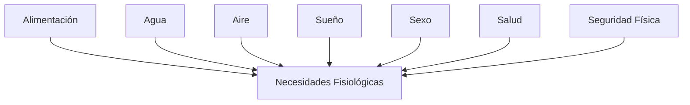
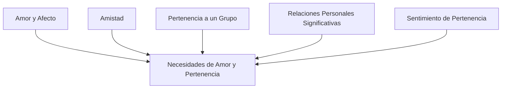
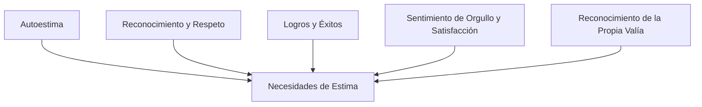
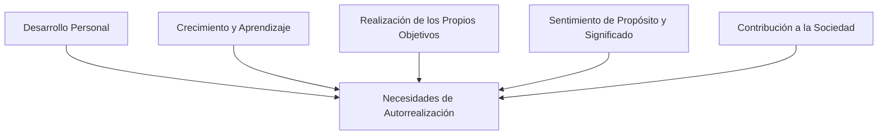

# La Pirámide de Maslow  🔴②
## Introducción

La pirámide de Maslow es una teoría psicológica desarrollada por Abraham Maslow en 1943, que describe las necesidades humanas de manera jerárquica. Esta teoría se basa en la idea de que las personas tienen diferentes niveles de necesidades, y que cada nivel debe ser satisfecho antes de que se puedan satisfacer las necesidades del siguiente nivel.

## La pirámide de Maslow

La pirámide de Maslow se compone de cinco niveles de necesidades, que se pueden clasificar en dos categorías: necesidades básicas y necesidades de crecimiento.

### Estructura general

La estructura general de la pirámide de Maslow se puede representar de la siguiente manera:

### Características de la pirámide de Maslow

* **Jerarquía**: La pirámide de Maslow se basa en la idea de que las necesidades más básicas deben ser satisfechas antes de que se puedan satisfacer las necesidades del siguiente nivel.
* **Prioridad**: Las necesidades más básicas tienen prioridad sobre las necesidades de crecimiento.
* **Interconexión**: Las necesidades de cada nivel están interconectadas y se influyen mutuamente.
* **Dinamismo**: La pirámide de Maslow no es estática, sino que se puede mover hacia arriba o hacia abajo dependiendo de las circunstancias de la persona.

### Necesidades Fisiológicas

Las necesidades fisiológicas son las necesidades más básicas y fundamentales para la supervivencia humana. Estas necesidades incluyen:

### Necesidades de Seguridad

Las necesidades de seguridad se relacionan con la estabilidad y la protección. Estas necesidades incluyen:

### Necesidades de Amor y Pertenencia

Las necesidades de amor y pertenencia se relacionan con la conexión social y la pertenencia a un grupo. Estas necesidades incluyen:

### Necesidades de Estima

Las necesidades de estima se relacionan con la autoestima y el reconocimiento. Estas necesidades incluyen:

### Necesidades de Autorrealización

Las necesidades de autorrealización son las necesidades más altas y se relacionan con la realización personal y el crecimiento. Estas necesidades incluyen:

## Críticas y limitaciones de la pirámide de Maslow

La pirámide de Maslow ha sido objeto de críticas y limitaciones, algunas de las cuales incluyen:

* **Simplificación excesiva**: La pirámide de Maslow se ha criticado por simplificar demasiado la complejidad de las necesidades humanas.
* **Culturalmente limitada**: La teoría se basa en la cultura occidental y puede no ser aplicable a otras culturas.
* **No considera la individualidad**: La pirámide de Maslow no considera las diferencias individuales y las necesidades únicas de cada persona.
* **No es una teoría predictiva**: La pirámide de Maslow no es una teoría predictiva, es decir, no puede predecir con certeza cómo se comportará una persona en una situación determinada.

## Aplicaciones de la pirámide de Maslow

La pirámide de Maslow tiene diversas aplicaciones en diferentes campos, incluyendo:

* **Psicología**: La pirámide de Maslow se utiliza en la psicología para entender las motivaciones y necesidades de las personas.
* **Educación**: La teoría se utiliza en la educación para diseñar programas y currículos que satisfagan las necesidades de los estudiantes.
* **Negocios**: La pirámide de Maslow se utiliza en los negocios para entender las necesidades y motivaciones de los empleados y clientes.
* **Desarrollo personal**: La teoría se utiliza en el desarrollo personal para ayudar a las personas a identificar y satisfacer sus necesidades y objetivos.

## Referencias bibliográficas que apoyan la teoría de Maslow

* Maslow, A. H. (1943). A theory of human motivation. Psychological Review, 50(4), 370-396.
* Maslow, A. H. (1954). Motivation and personality. Harper & Row.
* Rogers, C. R. (1951). Client-centered therapy. Houghton Mifflin.

## Referencias bibliográficas que refutan la teoría de Maslow

* Wahba, M. A., & Bridwell, L. G. (1976). Maslow reconsidered: A review of research on the need hierarchy theory. Organizational Behavior and Human2), 212-240.
* Neher, A. (1991). Maslow's theory of motivation: A critique. Journal of Humanistic Psychology, 31(3), 89-112.
* Tay, L., & Diener, E. (2011). Needs and subjective well-being around the world. Journal of Personality and Social Psychology, 101(2), 354-365.

![[Plantilla - 1MT#One More Thing]]