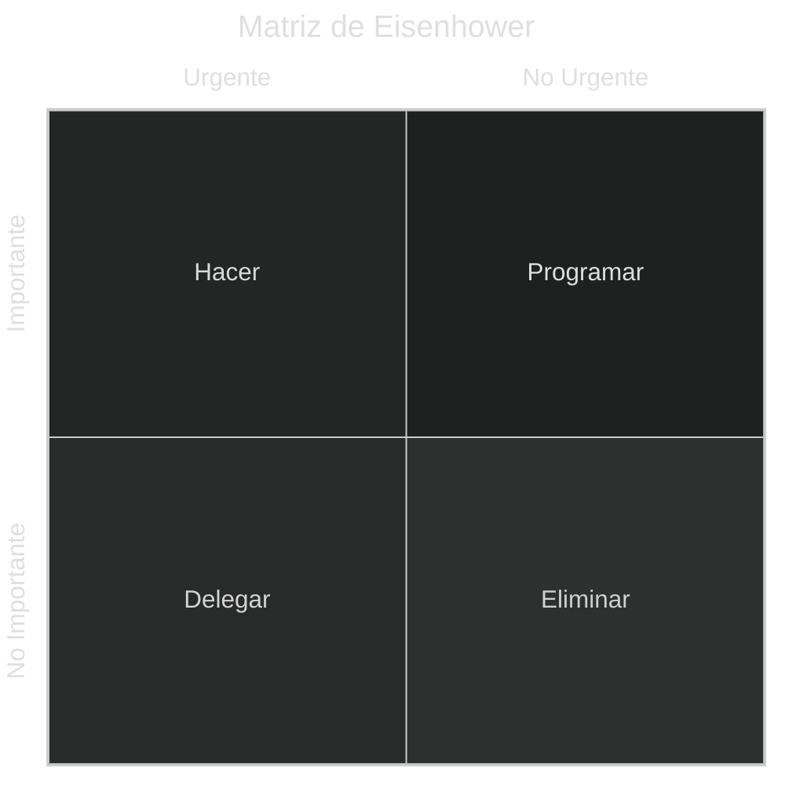

# Métodos de Gestión de Tareas con papel y lápiz

[[Aprender sobre Gestión de Tareas]]

Es importante destacar que los métodos de gestión de tareas con papel y lápiz son una forma efectiva y accesible de organizar y realizar un seguimiento de tus actividades diarias, proyectos y objetivos. Aunque existen muchas herramientas y aplicaciones digitales para la gestión de tareas, la escritura a mano en papel ofrece algunas ventajas, como la simplicidad, la falta de distracciones digitales y la portabilidad. Aquí hay algunos métodos populares de gestión de tareas con papel y lápiz:

## Método GTD (Getting Things Done):
    
- El método GTD, desarrollado por David Allen, se centra en capturar todas tus tareas y compromisos en una lista llamada "Bandeja de Entrada". Luego, procesas estas tareas, asignándoles prioridades y organizándolas en listas específicas según su contexto o proyecto. El método GTD utiliza una combinación de listas y categorías para ayudarte a mantener un registro claro de tus actividades.

## Bullet Journal (BuJo):
    
- El sistema de Bullet Journal es una forma altamente personalizable de realizar un seguimiento de tareas, metas y eventos. Se basa en símbolos y notaciones simples para indicar tareas completadas, tareas pendientes y eventos. El método BuJo te permite crear tus propias listas y diseños, lo que lo hace adecuado para adaptarse a tus necesidades específicas.

## Matriz de Eisenhower:

Esta matriz divide tus tareas en cuatro cuadrantes según su importancia y urgencia. Puedes utilizar una hoja de papel para crear una matriz de 2x2 con cuatro secciones: "Urgente e Importante", "Importante pero no Urgente", "Urgente pero no Importante" y "Ni Urgente ni Importante". Esto te ayuda a priorizar tus tareas y enfocarte en lo que realmente importa.

Concretamente, las tareas que caen en cada cuadrante se gestionarían del siguiente modo:

 - Importante y Urgente: Hacer
- Importante y No Urgente: Programar
- No Importante y Urgente: Delegar
- No Importante y No Urgente: Eliminar

Personalmente, dentro del contexto de la gestión de tareas de MetsukeOS, prefiero considerar "IDLE Task" para el cuadrante No Importante / No Urgente empresarialmente, para aquellas tareas Relevantes Personalmente, lo cual convierte la matriz de Eisenhower en [[El Cubo de MetsukeOS]], pero esa, es otra historia ;)

## Planificador Diario o Semanal:

- Un planificador diario o semanal te permite organizarte para el día o la semana. Puedes anotar tus tareas, objetivos y citas importantes, asignando tiempo específico a cada tarea si es necesario. Esto te proporciona una visión general de tu día o semana y te ayuda a programar tu tiempo de manera efectiva.

## Listas de Tareas To-Do:
    
- Las simples listas de tareas son una forma rápida y efectiva de anotar las tareas que debes realizar. Puedes utilizar una página en blanco o una libreta para escribir tus tareas pendientes, marcarlas a medida que se completan y agregar nuevas tareas según sea necesario. Esto proporciona una visión clara de lo que queda por hacer.
## Diario de Objetivos:
   
- Un diario de objetivos te permite establecer metas a corto y largo plazo y realizar un seguimiento de tu progreso hacia ellas. Puedes utilizar una libreta para anotar tus objetivos y las acciones necesarias para alcanzarlos. También puedes hacer un seguimiento de tus logros y ajustar tus objetivos según sea necesario.

Los métodos de gestión de tareas con papel y lápiz son versátiles y pueden adaptarse a tus preferencias personales. Puedes combinar varios de estos métodos según tus necesidades y estilo de trabajo. La clave es encontrar un enfoque que te ayude a mantenerte organizado y productivo en tu vida diaria.