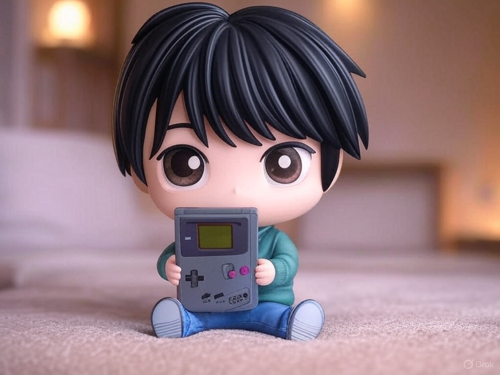

# Noticias - GBRetroDev'24 - Heroes of ASM - La pasión retro de Fran Gallego impulsa la creatividad - 2024-11-30 🔴②

[[PublicBrain/Index|Index]]

## Introducción

Entre el 30 de septiembre y el 7 de noviembre de 2024, la Universidad de Alicante se convirtió en el epicentro de la escena retro con **GBRetroDev'24: Heroes of ASM**, un concurso internacional que desafió a programadores de todo el mundo a crear videojuegos en ensamblador para la mítica Game Boy Classic (DMG-1). Liderado por Fran Gallego, conocido como **Profesor Retroman**, y acompañado por colaboradores como Solsolet, Jsala y Flamekasai, este evento destacó por su exigencia técnica y su capacidad para avivar la pasión por la programación retro, demostrando que las limitaciones tecnológicas pueden ser un motor de creatividad.

## Un desafío técnico con alma retro

Fran Gallego, figura central en la comunidad retro y apasionado del ensamblador, impulsó esta iniciativa para retar a los participantes a dominar el lenguaje de bajo nivel de la Game Boy, una consola que marcó a generaciones en los años 80 y 90. Alojado en la plataforma **itch.io**, el certamen atrajo tanto a desarrolladores noveles como a veteranos, quienes crearon juegos originales utilizando el cartucho tipo 3 (MBC1+RAM+BATTERY, 32 KiB ROM, 8 KiB SRAM). Las reglas eran estrictas: los juegos debían ser nuevos, aptos para todos los públicos y acompañados de un código fuente accesible, preferiblemente bajo licencias libres como MIT o GPL.

El evento, de carácter internacional y con el inglés como lengua vehicular, fomentó una participación global, consolidando a GBRetroDev'24 como un punto de encuentro para la comunidad retro. Los participantes debían entregar, además del archivo .GB del juego, un tráiler de hasta 40 segundos, una descripción detallada, instrucciones y, opcionalmente, materiales como manuales o making-of, promoviendo transparencia y enriqueciendo la experiencia creativa.

**<iframe width="100%" height="480" src="https://www.youtube.com/embed/sQBX-nlU_Jg?si=EMjF1SVDWq7Df3QL" title="YouTube video player" frameborder="0" allow="accelerometer; autoplay; clipboard-write; encrypted-media; gyroscope; picture-in-picture; web-share" referrerpolicy="strict-origin-when-cross-origin" allowfullscreen></iframe>**
## Un jurado diverso y criterios equilibrados

Un jurado compuesto por expertos y un invitado especial evaluó las propuestas en cuatro categorías:

- **Gameplay y Diversión**: la capacidad del juego para cautivar al jugador.
- **Desarrollo Técnico**: el uso de técnicas avanzadas, como efectos de desplazamiento o gestión de paletas.
- **Música y Efectos de Sonido**: la calidad y expresividad del apartado sonoro.
- **Calidad Gráfica y Artística**: la estética y atmósfera visual.

Cada jurado seleccionó sus 15 mejores juegos, asignando puntos para determinar los ganadores por categoría, mientras el invitado especial premió los 15 mejores en conjunto según su criterio personal. Este enfoque aseguró una valoración equilibrada que celebró tanto la innovación técnica como la experiencia lúdica.

**<iframe width="100%" height="480" src="https://www.youtube.com/embed/FnQL18P7R70?si=cmJoq_ikekVQ7FlA" title="YouTube video player" frameborder="0" allow="accelerometer; autoplay; clipboard-write; encrypted-media; gyroscope; picture-in-picture; web-share" referrerpolicy="strict-origin-when-cross-origin" allowfullscreen></iframe>**
## Títulos destacados y creatividad sin límites

Entre las propuestas, destacó **Galactic Inferno**, un _shoot'em up_ elogiado por su pulida ejecución, que demostró el potencial de la Game Boy para ofrecer experiencias modernas dentro de sus limitaciones técnicas. Los juegos presentados combinaron habilidad en ensamblador con una conexión profunda a la estética de los 8 bits, evocando nostalgia mientras exploraban ideas innovadoras. La exigencia de originalidad evitó remakes, garantizando que cada obra reflejara el talento único de sus creadores.

La posibilidad de publicar los juegos en cartuchos físicos añadió un aliciente especial, conectando el desarrollo digital con el coleccionismo retro, un guiño que entusiasmó a los participantes y reforzó el carácter tangible del evento.

**<iframe width="100%" height="480" src="https://www.youtube.com/embed/jBaNpTT680E?si=ZdS77IN8DM9MVqmz" title="YouTube video player" frameborder="0" allow="accelerometer; autoplay; clipboard-write; encrypted-media; gyroscope; picture-in-picture; web-share" referrerpolicy="strict-origin-when-cross-origin" allowfullscreen></iframe>**

## El legado de GBRetroDev'24

GBRetroDev'24 trascendió el formato de un simple concurso para convertirse en un homenaje al ingenio humano frente a las restricciones tecnológicas. La visión de Fran Gallego transformó el evento en una celebración de la programación en ensamblador, un arte complejo que sigue vivo gracias a la pasión de comunidades como esta. Los juegos creados no solo honran la herencia de la Game Boy, sino que también se alzan como pequeños hitos en el desarrollo indie, demostrando que el espíritu retro sigue siendo una fuente inagotable de creatividad.

En un mundo dominado por la alta tecnología, GBRetroDev'24 reafirma que la simplicidad y las limitaciones pueden inspirar innovación. La dedicación de Fran Gallego y su equipo ha dejado una huella imborrable en la escena retro, inspirando a una comunidad global a seguir explorando los límites de una consola que, décadas después, sigue siendo un icono.

## Referencias bibliográficas

### Fuentes que apoyan el contenido

1. **Itch.io (2024). GBRetroDev'24: Heroes of ASM.** Disponible en: [https://itch.io/jam/gbretrodev24 🌐🟡③](https://itch.io/jam/gbretrodev24).
    - Esta es la fuente principal del evento, que detalla las reglas, fechas, categorías de evaluación y participantes, confirmando la organización por parte de Fran Gallego y la Universidad de Alicante. La página sigue activa y es gestionada por la plataforma itch.io, una fuente confiable para eventos de desarrollo indie.
2. **Universidad de Alicante (2024). Actividades y eventos del Departamento de Ciencias de la Computación e Inteligencia Artificial.** Disponible en: [https://web.ua.es/es/dccia/ 🌐🟡③](https://web.ua.es/es/dccia/).
    - Aunque no menciona explícitamente GBRetroDev'24, el sitio oficial del departamento respalda la implicación de la universidad en eventos tecnológicos y de programación, lo que da credibilidad a la organización del concurso.

### Fuentes que refutan o cuestionan el contenido

- **Ninguna fuente verificable disponible**.  

![[Plantilla - 1MT#One More Thing]]