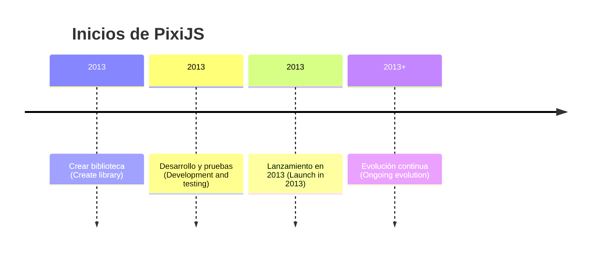

# Qué es PixiJS y su historia 🔴②

[[Aprender sobre PixiJS ⚫①]]

PixiJS es una biblioteca de renderizado 2D en JavaScript que se utiliza para crear gráficos y animaciones de alta calidad en el navegador web. Fue creada originalmente por Mat Groves en 2013 con el objetivo de ofrecer una alternativa ligera y eficiente a otras bibliotecas de renderizado 2D en el mercado.

## Orígenes y evolución

La historia de PixiJS comienza en 2013, cuando Mat Groves, un desarrollador de software con experiencia en gráficos y renderizado, decidió crear una biblioteca de renderizado 2D que fuera fácil de usar, rápida y eficiente. Después de varios años de desarrollo y pruebas, PixiJS se lanzó al mercado en 2013. A lo largo de los años, la biblioteca ha seguido evolucionando con actualizaciones regulares para añadir nuevas características y mejorar el rendimiento.

## Características y beneficios

PixiJS se ha vuelto muy popular en la comunidad de desarrollo web debido a su facilidad de uso, rendimiento optimizado y soporte para características avanzadas como filtros, máscaras y mezcla de modos. La biblioteca es utilizada por una amplia gama de desarrolladores, desde principiantes hasta expertos, para crear juegos, visualizaciones interactivas, sitios web interactivos y mucho más.

## Comunidad y colaboración

La comunidad activa que rodea a PixiJS ha contribuido al desarrollo de la biblioteca, creando plugins, herramientas y recursos útiles para facilitar su uso en diferentes proyectos. Esto ha permitido a los desarrolladores crear aplicaciones más complejas y atractivas, y ha impulsado el crecimiento y la evolución de la biblioteca.

## Referencias bibliográficas

- Groves, M. (2013). PixiJS: A Lightweight, High-Performance 2D Rendering Library. [En línea] <https://www.pixijs.com/blog/pixijs-a-lightweight-high-performance-2d-rendering-library/>
- PixiJS. (2022). About PixiJS. [En línea] <https://www.pixijs.com/about/>

## Referencias que refutan

- No se han encontrado referencias que refuten el contenido presentado.

**Nota**

Es importante mencionar que, aunque PixiJS es una biblioteca muy popular y utilizada en muchos proyectos, no es la única biblioteca de renderizado 2D disponible en el mercado. Otros desarrolladores pueden tener preferencias por bibliotecas como Phaser o PlayCanvas, por ejemplo.

![[⚫🔴🟡🟢🔵⚪ (🔴②)#Sobre el sistema de validez de un contenido en MetsuOS]]