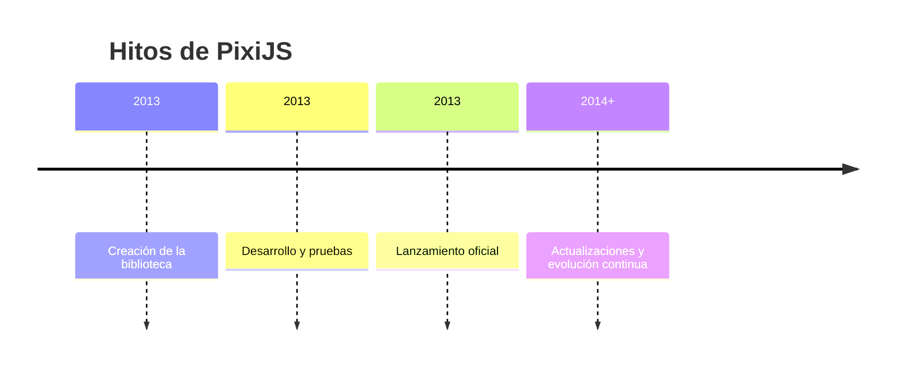

# Qué es PixiJS y su historia 🟡③

[[Curso de PixiJS ⚫①]]

**PixiJS** es una potente biblioteca de renderizado 2D en JavaScript diseñada para crear gráficos y animaciones interactivas de alta calidad en navegadores web. Reconocida por su rendimiento optimizado y facilidad de uso, PixiJS permite a los desarrolladores construir desde juegos hasta visualizaciones dinámicas con gran eficiencia.

## Orígenes y evolución

PixiJS nació en 2013 de la mano de **Mat Groves**, un desarrollador con experiencia en gráficos y renderizado. Su objetivo era crear una biblioteca ligera, rápida y accesible que superara las limitaciones de otras herramientas de renderizado 2D de la época. Tras un intenso período de desarrollo y pruebas, PixiJS se lanzó oficialmente en 2013 y desde entonces ha evolucionado con actualizaciones continuas que incorporan nuevas funcionalidades y mejoras de rendimiento.

Hoy, PixiJS es un estándar en el desarrollo de aplicaciones 2D, gracias a su capacidad para manejar gráficos complejos en WebGL (con fallback a Canvas) y su compatibilidad con navegadores modernos.

## Características y beneficios

PixiJS destaca por su combinación de simplicidad y potencia. Algunas de sus características clave incluyen:

- **Rendimiento optimizado**: Utiliza WebGL para un renderizado rápido, con soporte para Canvas como alternativa.
- **Facilidad de uso**: Su API intuitiva permite a desarrolladores de todos los niveles crear proyectos rápidamente.
- **Funcionalidades avanzadas**: Soporte para filtros, máscaras, modos de mezcla y gestión de texturas.
- **Versatilidad**: Ideal para juegos, animaciones, visualizaciones de datos y sitios web interactivos.

Estas cualidades han convertido a PixiJS en una herramienta predilecta para desarrolladores que buscan resultados profesionales sin sacrificar rendimiento.

## Comunidad y colaboración

La comunidad de PixiJS es uno de sus mayores activos. Desarrolladores de todo el mundo contribuyen con **plugins**, **herramientas** y **tutoriales**, enriqueciendo el ecosistema de la biblioteca. Esta colaboración ha permitido que PixiJS se adapte a una amplia variedad de proyectos, desde aplicaciones móviles hasta experiencias web inmersivas. Foros, repositorios en GitHub y eventos comunitarios mantienen viva la innovación en torno a PixiJS.

## Casos de uso destacados

PixiJS ha sido utilizado en proyectos de alto perfil, como:

- **Juegos web**: Títulos interactivos que aprovechan su renderizado fluido.
- **Visualizaciones de datos**: Gráficos dinámicos para dashboards y presentaciones.
- **Publicidad digital**: Banners y anuncios animados con gran impacto visual.

## Referencias Bibliográficas que apoyan el contenido

- [Groves, M. (2013). *PixiJS: A Lightweight, High-Performance 2D Rendering Library* 🌐🟡③](https://pixijs.com/blog)
- [PixiJS. (2025). PixiJS FAQ 🌐🟡③](https://pixijs.com/8.x/faq)
- [Documentación oficial de PixiJS 🌐🟡③](https://pixijs.download/release/docs/index.html)

## Referencias Bibliográficas que refutan el contenido

- **Ninguna fuente verificable disponible**.  

![[Plantilla - 1MT#One More Thing]]