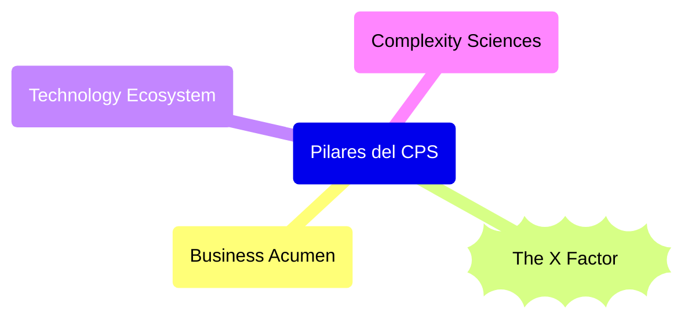

# Visión del CPS de Javier G. Recuenco 🔴②

[[Aprender con Javier G. Recuenco 🔴②]] | [[Aprender sobre CPS (Complex Problem Solving) ⚫①]]

Esta guía ofrece un itinerario claro y accesible para explorar la visión de Javier G. Recuenco sobre el _Complex Problem Solving_ (CPS), un enfoque innovador que aborda problemas complejos mediante la integración de personotecnia, tecnología, filosofía estoica y estrategias colaborativas. Pensada para estudiantes, investigadores y profesionales, está estructurada en secciones temáticas que cubren los fundamentos teóricos, las aplicaciones prácticas, el contexto cultural y las posibles críticas. Cada apartado incluye subtemas específicos y sugerencias prácticas para un análisis profundo, con el objetivo de facilitar una comprensión completa de esta metodología transformadora.

## 1. Fundamentos de la Visión del CPS

Conocer los principios que sustentan el enfoque de Recuenco es el primer paso para comprender su propuesta.

### 1.1. Definición y Esencia del CPS

- **Concepto clave**: Analizar cómo Recuenco define el CPS como un proceso iterativo y no lineal, diseñado para entornos de alta incertidumbre, diferenciándolo de problemas complicados que tienen soluciones predecibles.
- **Metáfora del juego**: Explorar su comparación del CPS con un “roguelite deckbuilding game”, donde la gestión de la incertidumbre y la adaptación continua son esenciales.
- **Crítica al elitismo**: Investigar su rechazo a las soluciones universales y al liderazgo intelectual, promoviendo un enfoque inclusivo y colaborativo.

### 1.2. Pilares Metodológicos

- **Sensemaking**: Estudiar el rol del sensemaking en la identificación y diagnóstico de problemas complejos, integrándolo como parte de un conjunto interdisciplinario.
- **Orquestación cognitiva**: Analizar la función del CPS como un “director de orquesta” que coordina equipos, conocimientos y recursos para generar soluciones efectivas.
- **Skin in the Game**: Examinar la importancia del compromiso personal, inspirado en Nassim Taleb, como motor de implicación y responsabilidad en el proceso.

### 1.3. Influencias Teóricas

- **Filosofía estoica**: Explorar cómo principios como el autocontrol y la aceptación de lo impredecible moldean el enfoque de Recuenco hacia el CPS.
- **Personotecnia**: Investigar el uso de la personalización basada en datos como herramienta estratégica para resolver problemas complejos.
- **Sistemas complejos**: Analizar la influencia de autores como Donella Meadows, cuya crítica a los modelos predictivos rígidos resuena en el lema de Recuenco: “all models are wrong”.

## 2. Componentes Clave del CPS

Esta sección desglosa los elementos prácticos que dan forma a la metodología de Recuenco.

### 2.1. Enfoque Iterativo

- **Ciclo de aprendizaje**: Estudiar cómo cada iteración del CPS amplía la comprensión del problema mediante nuevos _insights_ y ajustes, fomentando un aprendizaje continuo.
- **Gestión de puntos ciegos**: Analizar la estrategia de Recuenco para abordar la falta de información inicial, inspirada en el principio japonés “Genchi Gembutsu” (ir a la fuente).
- **Paciencia estratégica**: Investigar por qué aceptar múltiples iteraciones, sin buscar soluciones rápidas, es crucial para problemas complejos.

### 2.2. Equipos Transdisciplinarios

- **Equipos como “navajas suizas”**: Explorar su ideal de equipos con conocimientos amplios, especialización profunda y una curiosidad insaciable.
- **El rol del orquestador**: Analizar la función del facilitador en la gestión de dinámicas de grupo, identificando talentos y alineando esfuerzos.
- **Factor humano impredecible**: Estudiar cómo Recuenco incorpora el comportamiento humano, o “Factor X”, en la planificación, evitando una confianza excesiva en la lógica racional.

### 2.3. Equilibrio entre Disciplina y Creatividad

- **Metáfora Pirlo + Gattuso**: Analizar su analogía futbolística, que combina disciplina estratégica (80%) con destellos de creatividad (20%) para resolver problemas.
- **Rechazo al cientifismo**: Investigar su crítica a la ilusión de control en entornos complejos, abogando por un enfoque exploratorio y flexible.
- **Confianza humilde**: Estudiar la “humble confidence” como una actitud que permite dudar constructivamente sin caer en la inseguridad.

## 3. Aplicaciones Prácticas del CPS

El CPS de Recuenco tiene aplicaciones en múltiples ámbitos, desde la empresa hasta los retos sociales.

### 3.1. Transformación Digital

- **Digitalización vs. transformación**: Analizar su distinción entre adoptar herramientas digitales y lograr una transformación profunda, como expuso en su ponencia sobre comercio en Teruel.
- **Casos empresariales**: Investigar su trabajo con SNGULAR y Performics, donde aplica el CPS para resolver desafíos de innovación y competitividad.
- **Unconventional CPS**: Estudiar esta iniciativa como un modelo para abordar problemas empresariales mediante equipos transdisciplinarios.

### 3.2. Educación y Formación

- **Máster en CPS (UNIR)**: Analizar el programa dirigido por Recuenco, destacando su enfoque práctico y colaborativo para formar profesionales en CPS.
- **Mentoría**: Investigar su labor como mentor en Startups Institute y Plug and Play, evaluando su impacto en el desarrollo de emprendedores.
- **Comunidad CPS**: Explorar las “turras” y actividades de la Comunidad CPS como espacios de aprendizaje colectivo y reflexión.

### 3.3. Resolución de Problemas Sociales

- **Crisis globales**: Analizar cómo Recuenco aplica el CPS a problemas como la escasez de materias primas o conflictos internacionales, identificando patrones estratégicos.
- **Gestión de la incertidumbre**: Estudiar el papel de su perspectiva estoica en la resolución de retos sociales, como los cambios en valores generacionales.
- **Análisis del metajuego**: Investigar su enfoque del “metajuego” en contextos competitivos, como la rivalidad entre Edison y Tesla en la guerra de las corrientes.

## 4. Contexto e Influencias Culturales

Situar el CPS de Recuenco en su entorno cultural y tecnológico ayuda a evaluar su relevancia.

### 4.1. Contexto Tecnológico

- **Sociedad digital**: Analizar cómo la aceleración tecnológica y la complejidad de los datos han moldeado su visión del CPS.
- **Inteligencia artificial**: Estudiar su perspectiva sobre la IA como una herramienta complementaria dentro del CPS, no como una solución definitiva.
- **Blitzscaling y humanización**: Investigar su reflexión sobre el impacto del crecimiento empresarial rápido y la necesidad de priorizar el “lujo humano”.

### 4.2. Contexto Español

- **Mensa España**: Analizar cómo su presidencia en Mensa refleja su compromiso con la colaboración intelectual y su rechazo al elitismo.
- **Ecosistema emprendedor**: Estudiar su contribución al emprendimiento español a través de Startups Institute, promoviendo startups con alcance global.
- **Eventos locales**: Investigar su participación en eventos como el Congreso Aragonés de Comercio e Innovación para entender su impacto en España.

### 4.3. Debates Globales

- **Ética tecnológica**: Analizar cómo el CPS aborda dilemas éticos en la personalización y el uso de la IA.
- **Capitalismo y complejidad**: Estudiar su crítica al “capitalismo hostiado” y su búsqueda de un equilibrio entre las ideas de Piketty y Mazzucato.
- **Futurismo estratégico**: Explorar su concepto de “futurismo de frontera” como anticipación proactiva en entornos complejos.

## 5. Metodología para un Estudio Profundo

Esta sección ofrece pasos prácticos para abordar el estudio del CPS de Recuenco con rigor.

### 5.1. Fuentes Primarias

- **Obras y artículos**: Leer _Personalización_ y _El pequeño libro de la filosofía estoica_, además de sus publicaciones en Sintetia y Xataka Móvil, para captar sus ideas fundacionales.
- **Contenido digital**: Analizar las 207 “turras” de la Comunidad CPS en El Turrero Post y sus hilos en Twitter (@Recuenco) para conocer su pensamiento actual.
- **Conferencias y podcasts**: Escuchar sus intervenciones en _El Rincón de Aquiles_ o eventos como #CPSLive2024 para entender su discurso en acción.

### 5.2. Fuentes Secundarias

- **Reseñas**: Consultar críticas de sus libros en plataformas como Gurulibros y PlanetadeLibros para evaluar su recepción.
- **Entrevistas**: Buscar entrevistas en medios como _Diario de Teruel_ o _Periódico Publicidad_ para obtener perspectivas aplicadas.
- **Literatura académica**: Revisar artículos sobre CPS, personotecnia y sistemas complejos en bases como Google Scholar para contextualizar su trabajo.

### 5.3. Análisis Crítico

- **Comparación con otras metodologías**: Contrastar el CPS de Recuenco con enfoques como Design Thinking o Agile, destacando sus fortalezas y diferencias.
- **Evaluación de impacto**: Analizar el éxito de iniciativas como Unconventional CPS en contextos reales.
- **Limitaciones**: Identificar posibles críticas, como la dificultad de aplicar el CPS en entornos con recursos limitados o equipos poco especializados.

## 6. Recursos Adicionales

- **Bibliografía recomendada**:
    - Taleb, N. N. (2018). _Skin in the Game_. Random House. Para profundizar en el compromiso personal en el CPS.
    - Meadows, D. H. (2008). _Thinking in Systems_. Chelsea Green Publishing. Para entender los sistemas complejos.
    - Greene, R. (2012). _Mastery_. Viking. Para explorar el aprendizaje continuo en el CPS.
- **Plataformas digitales**:
    - Twitter: [https://twitter.com/Recuenco](https://twitter.com/Recuenco)
    - LinkedIn: [https://www.linkedin.com/in/javier-g-recuenco-70a708/](https://www.linkedin.com/in/javier-g-recuenco-70a708/)
    - El Turrero Post: [https://turrero.vercel.app/](https://turrero.vercel.app/)
- **Eventos**: Seguir iniciativas como #CPSLive2024 y meetups de la Comunidad CPS para mantenerse actualizado.

## 7. Líneas de Investigación Futura

- **Evolución del CPS**: Evaluar cómo el enfoque de Recuenco se adapta a los avances en inteligencia artificial y tecnología.
- **Aplicaciones sectoriales**: Investigar su impacto en áreas como la educación, la salud o la sostenibilidad.
- **Alcance global**: Analizar la adopción del CPS en contextos internacionales, más allá del ámbito español.

## 8. Referencias Bibliográficas de Apoyo

Estas fuentes respaldan la visión de Recuenco, destacando su enfoque iterativo, interdisciplinario y centrado en la 1. 

1. [Taleb, N. N. (2018). _Skin in the Game_. Random House. 🟡③🌐](https://www.penguinrandomhouse.com/books/537828/skin-in-the-game-by-nassim-nicholas-taleb/) .- Refuerza la importancia del compromiso personal en la resolución de problemas, un pilar clave del CPS de Recuenco.
2. [Meadows, D. H. (2008). _Thinking in Systems_. Chelsea Green Publishing. 🟡③🌐](https://www.chelseagreen.com/product/thinking-in-systems/) .- Apoya su enfoque en los sistemas complejos y su crítica a los modelos predictivos rígidos, alineándose con la filosofía de Recuenco.
3. [Senge, P. M. (1990). _The Fifth Discipline_. Doubleday. 🟡③🌐](https://books.google.com/books/about/The_Fifth_Discipline.html?id=bVZqAAAAMAAJ) .- Complementa su visión de la orquestación y el aprendizaje colectivo, fundamentales en los equipos transdisciplinarios del CPS.

## 9. Referencias Bibliográficas de Refutación

Algunas perspectivas podrían cuestionar aspectos del CPS de Recuenco, como su complejidad o su dependencia de recursos especializados:

1. [Zuboff, S. (2019). _La era del capitalismo de la vigilancia_. Paidós. 🟡③🌐](https://www.planetadelibros.com/libro-la-era-del-capitalismo-de-la-vigilancia/311701) .- Critica la personalización basada en datos, señalando riesgos éticos que podrían aplicarse a la personotecnia dentro del CPS.
2. [Weick, K. E. (1995). _Sensemaking in Organizations_. Sage. 🟡③🌐](https://us.sagepub.com/en-us/nam/sensemaking-in-organizations/book4988) .- Aunque apoya el sensemaking, su enfoque organizacional podría considerar el CPS de Recuenco excesivamente técnico o centrado en el facilitador.
3. [Mintzberg, H. (1994). _The Rise and Fall of Strategic Planning_. Free Press. 🟡③🌐](https://books.google.com/books/about/Rise_and_Fall_of_Strategic_Planning.html?hl=es&id=TugplxDii8MC) .- Argumenta que las metodologías estratégicas complejas, como el CPS, pueden ser menos efectivas que enfoques más simples en ciertos contextos.

Esta guía proporciona un marco claro y detallado para estudiar la visión del CPS de Javier G. Recuenco, integrando teoría, práctica y reflexión crítica. Se recomienda personalizar el enfoque según los intereses del investigador, priorizando las secciones más relevantes para el estudio.

---
## Old Elements, Review

---
* [CPS Notebook (notion.site)](https://cps-notebook.notion.site/CPS-Notebook-81fe17dc15d04e9db085cf7f747d0c16)*
* Corolario-Hipotesis de hoy tras lectura diagonal de [https://cps-notebook.notion.site/CPS-101-una-introducci-n-de-10-minutos-f0181b6f59ec4ee7ab682d1cb2ceece9…](https://t.co/CuFypWru3P): MetsuOS = Implementación Probabilística Bottom-Up de un framework que aplica CPS Dinámico (version 0.0.1 de la hipotesis de trabajo)
---

En este libro trato de comprender y en el futuro modelar, el Mindset CPS de Javier Recuenco a partir de  la linea de salida https://twitter.com/recuenco/status/1340174209343995905 y explorando desde ahi.

## Elementos Estructurales

El ["mapa del framework" necesario para trabajar CPS](https://pbs.twimg.com/media/EplBMYCXUAIzB9n?format=png&name=900x900) desarrollado quedaría tal que así (WIP)

* Pilares del CPS
	* Business Acumen
	* The X Factor
	* Technology Ecosystem
	* [ ] Complexity Sciences[]()

## Hilos Turra específicos sobre CPS

* [¿Qué es el CPS, que no y otras mierdas? Lección 01 (2024-03-09)](https://twitter.com/Recuenco/status/1766352097409134910)
* ¿Qué es el CPS, que no y otras mierdas? Lección 02 (Proximamente)

[[Aprender sobre CPS (Complex Problem Solving) ⚫①]]]

![[Plantilla - 1MT#One More Thing]]
