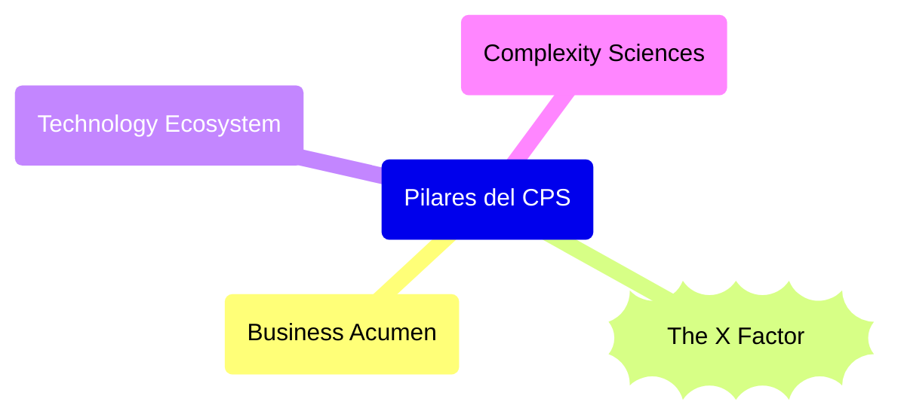

# Visión del CPS de Javier G. Recuenco

[[Aprender con Javier G. Recuenco]] | [[Aprender sobre CPS (Complex Problem Solving)]]

---
* [CPS Notebook (notion.site)](https://cps-notebook.notion.site/CPS-Notebook-81fe17dc15d04e9db085cf7f747d0c16)*
* Corolario-Hipotesis de hoy tras lectura diagonal de [https://cps-notebook.notion.site/CPS-101-una-introducci-n-de-10-minutos-f0181b6f59ec4ee7ab682d1cb2ceece9…](https://t.co/CuFypWru3P): MetsuOS = Implementación Probabilística Bottom-Up de un framework que aplica CPS Dinámico (version 0.0.1 de la hipotesis de trabajo)
---

En este libro trato de comprender y en el futuro modelar, el Mindset CPS de Javier Recuenco a partir de  la linea de salida https://twitter.com/recuenco/status/1340174209343995905 y explorando desde ahi.

## Elementos Estructurales

El ["mapa del framework" necesario para trabajar CPS](https://pbs.twimg.com/media/EplBMYCXUAIzB9n?format=png&name=900x900) desarrollado quedaría tal que así (WIP)

* Pilares del CPS
	* Business Acumen
	* The X Factor
	* Technology Ecosystem
	* [ ] Complexity Sciences[]()

## Hilos Turra específicos sobre CPS

* [¿Qué es el CPS, que no y otras mierdas? Lección 01 (2024-03-09)](https://twitter.com/Recuenco/status/1766352097409134910)
* ¿Qué es el CPS, que no y otras mierdas? Lección 02 (Proximamente)

[[Aprender sobre CPS (Complex Problem Solving)]]]

